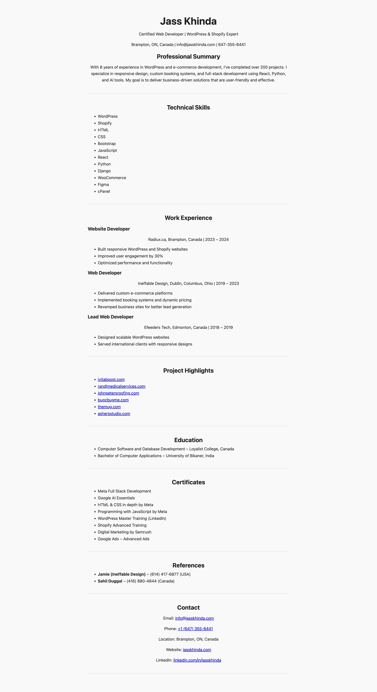

# React Resume Website – Jass Khinda

This is my personal resume website built using React for the CSDD2002 course at Loyalist College.

## Features
- Built with Vite + React
- Resume split into multiple components
- Styled using App.css
- Mobile responsive layout
- Deployed on Vercel

## Live Site
[https://jass-react-resume.vercel.app](https://jass-react-resume.vercel.app)

## GitHub Repo
[https://github.com/jasskhinda/jass-react-resume](https://github.com/jasskhinda/jass-react-resume)

## Screenshot

## Challenges
- Fixed blank screen caused by import and structure issues
- Used App.css for simple and effective styling

## Created by
**Jass Khinda**  
📧 info@jasskhinda.com
